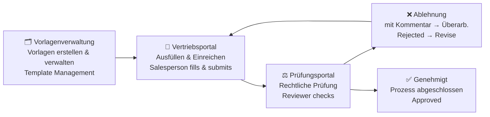

# 📋 Vertragsmanagementsystem · Contract Management System

<div align="center">

**Eine webbasierte Anwendung zur Verwaltung, Befüllung und Prüfung von Vertragsvorlagen nach deutschem Zivilrecht (BGB).**

*A web-based application for managing, filling, and reviewing contract templates under German civil law (BGB).*

[](LICENSE)
[](https://github.com/malala2409/contract-system-Vertragsmanagementsystem)
[](https://python.org)
[](https://flask.palletsprojects.com/)

</div>

---

## 📖 Inhaltsverzeichnis · Table of Contents

- [👥 Drei Portale · Three Portals](#-drei-portale--three-portals)
- [📸 Screenshots](#-screenshots)
- [🚀 Quick Start](#-quick-start)
- [⚡ Zwei Versionen · Two Versions](#-zwei-versionen--two-versions)
- [📁 Vertragstypen · Contract Types](#-vertragstypen--contract-types)
- [🔄 Workflow](#-workflow)
- [🌐 Internationalisierung · Internationalization](#-internationalisierung--internationalization)
- [🛠 Tech Stack](#-tech-stack)
- [📂 Projektstruktur · Project Structure](#-projektstruktur--project-structure)
- [🔀 Routen · Routes](#-routen--routes)
- [📄 Lizenz · License](#-lizenz--license)

---

## 👥 Drei Portale · Three Portals

Das System ist funktional in **drei Benutzerrollen** gegliedert:

*The system is functionally divided into **three user roles**:*

---

### 🛒 1. Vertriebsportal · Sales Portal

> **Zielgruppe:** Vertriebsmitarbeiter, die Verträge ausfüllen und einreichen.
> *Target audience: Salespeople who fill out and submit contracts.*

**Funktionen · Features:**

| Feature | Beschreibung · Description |
|---------|---------------------------|
| 📝 **Strukturiertes Ausfüllen** | Felder werden aus der Vorlage extrahiert und als Formular dargestellt — einfach ausfüllen, keine juristischen Kenntnisse nötig · *Fields extracted from template, presented as a form — no legal knowledge required* |
| ✏️ **Freitext-Modus** | Jeder Abschnitt kann bei Bedarf frei bearbeitet werden („Abschnitt bearbeiten"-Button), um individuelle Formulierungen einzufügen · *Any section can be freely edited via "Edit section" for custom wording* |
| 👁️ **Vorschau vor Einreichung** | Vor dem Absenden wird der komplette Vertrag mit farblich markierten Platzhaltern angezeigt · *Full preview with highlighted placeholders before submission* |
| 📊 **Status-Tracking** | Eigene Einreichungen im Dashboard verfolgen: ⏳ Ausstehend · ✅ Genehmigt · ❌ Abgelehnt · *Track own submissions: pending / approved / rejected* |
| 🔄 **Überarbeitung nach Ablehnung** | Abgelehnte Verträge können mit den Prüferkommentaren erneut bearbeitet und wieder eingereicht werden · *Rejected contracts can be edited with reviewer feedback and resubmitted* |

---

### 🛠 2. Vorlagenverwaltung · Template Management

> **Zielgruppe:** Administratoren & juristische Mitarbeiter, die Vertragsvorlagen erstellen und pflegen.
> *Target audience: Admins & legal staff who create and maintain contract templates.*

**Funktionen · Features:**

| Feature | Beschreibung · Description |
|---------|---------------------------|
| 🧩 **Drag-and-Drop-Assistent** | Neue Vorlagen per Drag-and-Drop aus vordefinierten Bausteinen zusammenstellen — visuell und intuitiv · *Build new templates by dragging and dropping predefined building blocks — visual and intuitive* |
| 📂 **Kategorie-Filter** | Vorlagen sind 7 BGB-Vertragstypen zugeordnet und danach filterbar · *Templates organized into 7 BGB contract types with filter* |
| 📎 **Dokumenten-Upload** | Word (.docx) oder PDF als Vorlage hochladen und mit Metadaten versehen · *Upload Word or PDF files as templates with metadata* |
| 🔒 **Passwortgeschütztes Löschen** | Löschen erfordert eine Passworteingabe (Standard: `1111`) — Schutz vor unbeabsichtigtem Löschen · *Deletion requires password confirmation — prevents accidental deletion* |

---

### ⚖️ 3. Prüfungsportal · Review Portal

> **Zielgruppe:** Rechtsabteilung / Compliance-Team, das eingereichte Verträge prüft.
> *Target audience: Legal / compliance team reviewing submitted contracts.*

**Funktionen · Features:**

| Feature | Beschreibung · Description |
|---------|---------------------------|
| ✅❌ **Genehmigen / Ablehnen** | Eingereichte Verträge mit einem Klick genehmigen oder ablehnen — Status wird sofort aktualisiert · *Approve or reject submissions with one click — status updates instantly* |
| 💬 **Prüfnotizen mit Verlauf** | Kommentare hinzufügen, ohne vorherige zu überschreiben — alle Notizen bleiben mit Zeitstempel erhalten (additive Historie) · *Add comments without overwriting previous ones — all notes preserved with timestamps (additive history)* |
| 🔴 **Freitext-Änderungen hervorheben** | Abschnitte, die vom Vertrieb außerhalb der Vorlage bearbeitet wurden, werden **rot markiert** und mit dem Originaltext verglichen — warnt den Prüfer vor genauer Kontrolle · *Sections modified outside the template are **highlighted in red** and compared with the original — alerts reviewer to scrutinize carefully* |
| 🔍 **Status-Filter** | Dashboard filterbar nach Status (ausstehend / genehmigt / abgelehnt) · *Dashboard filterable by status* |

---

## 📸 Screenshots

> Alle Screenshots zeigen die **Static-Version** (`index.html`) — läuft komplett im Browser, kein Server nötig.

### 🏠 Startseite · Home

<div align="center">
  
  
  <p><em>Dreiportal-Navigation (Vorlagen · Vertrieb · Prüfung) — vollständig zweisprachig DE/EN</em></p>
</div>

---

### 📁 Vorlagenverwaltung · Template Management

<div align="center">
  
  <p><em>Übersicht aller Vertragsvorlagen mit Kategorie-Filter — Daten persistent in localStorage</em></p>
</div>

---

### 🛠 Template-Editor · Template Editor

<div align="center">
  
  <p><em>Drag-and-Drop-Assistent zum Erstellen neuer Vorlagen aus vordefinierten Bausteinen</em></p>
</div>

---

### ✍️ Vertrag ausfüllen · Fill Contract

<div align="center">
  
  <p><em>Direktes Ausfüllen eines Vertrags: strukturiertes Formular mit Feldern aus der Vorlage</em></p>
</div>

---

### 🛒 Vertriebsportal · Sales Portal

<div align="center">
  
  <p><em>Personalisiertes Dashboard mit eigenen eingereichten Verträgen und ausfüllbaren Vorlagen</em></p>
</div>

<table>
<tr>
<td width="50%"><br><em>Ausfüllprozess mit Formular- und Freitextmodus</em></td>
<td width="50%"><br><em>Vorschauseite mit farblich hervorgehobenen Platzhaltern vor der Einreichung</em></td>
</tr>
</table>

<div align="center">
  
  <p><em>Status-Übersicht aller eingereichten Verträge (ausstehend / genehmigt / abgelehnt)</em></p>
</div>

---

### 🔍 Prüfungs-Workflow · Review Workflow

<table>
<tr>
<td width="50%"><br><em>Übersicht aller eingereichten Verträge mit Status-Filter</em></td>
<td width="50%"><br><em>Detailprüfung mit additiven Notizen, Historie und Genehmigung/Ablehnung</em></td>
</tr>
</table>

---

## 🚀 Quick Start

### ⚡ Static-Version (keine Installation)

Die Static-Version läuft vollständig im Browser mit localStorage — kein Server nötig.

```bash
# Einfach im Browser öffnen:
open index.html

# Oder mit jedem HTTP-Server:
python3 -m http.server 8080
# → http://localhost:8080
```

🌍 **Live-Demo:** [malala2409.github.io/contract-system](https://malala2409.github.io/contract-system/)

---

### 🐍 Flask-Version (mit Backend)

```bash
# 1. Abhängigkeiten installieren
pip install -r requirements.txt

# 2. Anwendung starten
python app.py

# 3. Im Browser öffnen
open http://localhost:5000
```

Die Datenbank wird beim ersten Start automatisch mit 7 BGB-Vertragsvorlagen befüllt.

> 💡 **Datenbank-Konfiguration:** Standardmäßig wird SQLite verwendet (zero-config). Für MySQL/PostgreSQL die Umgebungsvariable `DATABASE_URL` setzen oder eine `.env`-Datei anlegen (siehe `.env.example`).
> *Database: SQLite by default. Set `DATABASE_URL` or create a `.env` file for MySQL/PostgreSQL (see `.env.example`).*

---

## ⚡ Zwei Versionen · Two Versions

| Eigenschaft | Static | Flask |
|------------|--------|-------|
| **Technologie** | Vanilla JS (ES6), localStorage | Python 3.9+, Flask, SQLAlchemy |
| **Datenbank** | localStorage (clientseitig) | SQLite (default) / MySQL / PostgreSQL |
| **Installation** | Keine — `open index.html` | `pip install -r requirements.txt` |
| **Deployment** | Browser (`file://`) oder GitHub Pages | Jeder WSGI-Server |
| **Multi-User** | Nein (eine Browser-Session) | Ja (gemeinsame DB) |
| **Datei-Upload** | Nein | Ja (.docx, .pdf) |
| **Empfohlen für** | Demo, Einzelplatz, schnelles Testen | Produktion, Team-Einsatz |

Beide Versionen teilen sich dieselbe Codebasis für Templates, Logik und Internationalisierung.

---

## 📁 Vertragstypen · Contract Types

Das System enthält **7 BGB-Vertragsvorlagen** — jede mit detaillierten, zweisprachigen Abschnitten und ausfüllbaren Feldern:

| # | Vertragstyp | BGB-Vorschriften | Typische Felder |
|---|------------|-------------------|-----------------|
| 1 | **Kaufvertrag** | §§ 433 ff. BGB | Parteien, Kaufgegenstand, Kaufpreis, Lieferung, Gefahrübergang, Mängelhaftung |
| 2 | **Mietvertrag** | §§ 535 ff. BGB | Parteien, Mietsache, Miete, Betriebskosten, Kaution, Kündigungsfristen |
| 3 | **Dienstvertrag** | §§ 611 ff. BGB | Parteien, Leistungsumfang, Vergütung, Haftung, Kündigung |
| 4 | **Werkvertrag / Auftrag** | §§ 631 ff. BGB | Parteien, Werkerfolg, Vergütung, Abnahme, Mängelansprüche |
| 5 | **Darlehensvertrag** | §§ 488 ff. BGB | Parteien, Darlehensbetrag, Zinssatz, Tilgung, Sicherheiten |
| 6 | **Arbeitsvertrag** | §§ 611a ff. BGB | Parteien, Tätigkeit, Arbeitszeit, Vergütung, Urlaub, Kündigung |
| 7 | **Geheimhaltungsvereinbarung (NDA)** | §§ 280, 823 BGB | Parteien, Geheimnisdefinition, Nutzungsbeschränkung, Laufzeit, Vertragsstrafe |

Jede Vorlage kann über den **Template-Editor** angepasst oder durch eigene ersetzt werden.

---

## 🔄 Workflow



1. **Vorlagenverwaltung · Template Manager** — Erstellt und pflegt Vertragsvorlagen per Drag-and-Drop oder Datei-Upload. Löschen mit Passwortschutz. · *Creates and maintains contract templates via drag-and-drop or file upload. Password-protected deletion.*
2. **Vertriebsportal · Salesperson** — Wählt Vorlage, füllt Felder aus (strukturiert oder Freitext), sieht Vorschau und reicht ein. Verfolgt Status der eigenen Einreichungen. Bearbeitet abgelehnte Verträge anhand der Prüferkommentare. · *Selects template, fills in fields (structured or free text), previews and submits. Tracks own submission status. Edits rejected contracts using reviewer feedback.*
3. **Prüfungsportal · Reviewer** — Prüft eingereichte Verträge: genehmigen oder ablehnen, fügt additive Kommentare hinzu. Vom Vertrieb frei bearbeitete Abschnitte werden rot markiert. · *Reviews submitted contracts: approves or rejects, adds additive comments. Free-text edits by sales are highlighted in red.*
4. **Prüfhistorie · Audit Trail** — Jeder Schritt wird mit Zeitstempel dokumentiert; Notizen bleiben vollständig erhalten. · *Every step is timestamped; all notes are preserved in full history.*

---

## 🌐 Internationalisierung · Internationalization

- **164+ Übersetzungsschlüssel** in DE und EN
- Session-basierte Sprachumschaltung (`/lang/de` ↔ `/lang/en`)
- Vorlageninhalte vollständig zweisprachig (deutsche und englische Klauseltexte)
- UI-Elemente, Statusbezeichnungen, Flash-Messages — alles übersetzt
- Eigenes, leichtgewichtiges i18n-System (keine externen Abhängigkeiten)

---

## 🛠 Tech Stack

| Ebene | Technologie |
|-------|------------|
| **Backend** | Python 3.9+, Flask 3.1, Jinja2 |
| **ORM** | SQLAlchemy + Flask-SQLAlchemy |
| **Datenbank** | SQLite (default), MySQL / PostgreSQL optional |
| **Frontend** | Jinja2 Templates, Tailwind CSS (CDN), Vanilla JS (ES6) |
| **Static Alt.** | localStorage, SessionStorage, Hash-basierter SPA-Router |
| **Fonts** | DM Sans, DM Serif Display, DM Mono (Google Fonts) |
| **i18n** | Eigenes Session-basiertes System (DE/EN), 164+ Keys |

---

## 📂 Projektstruktur · Project Structure

```
Vertragsmanagementsystem/
│
├── app.py                      # Flask-Anwendung (Routen, Helpers, MIME-Upload)
├── models.py                   # SQLAlchemy-Modelle (Category, Template, Submission)
├── database.py                 # DB-Initialisierung & Seed-Templates (7 Vertragstypen)
├── i18n.py                     # DE/EN-Übersetzungstabelle (164+ Keys)
├── requirements.txt            # Python-Abhängigkeiten
├── .env.example                # Beispiel für DATABASE_URL-Konfiguration
├── index.html                  # Entry-Point für die Static-Version (SPA)
│
├── templates/                  # Jinja2 HTML-Templates (Flask-Version)
│   ├── base.html               # Basis-Layout mit Navbar & Footer
│   ├── home.html               # Startseite mit 3-Portal-Navigation
│   ├── manage.html             # Vorlagenverwaltung (Upload, Filter, Download)
│   ├── template_editor.html    # Drag-and-Drop Vorlagen-Assistent
│   ├── fill.html               # Vertragsformular (strukturiert + Freitext)
│   ├── sales_home.html         # Vertriebsportal-Dashboard
│   ├── sales_overview.html     # Vorschau vor Einreichung
│   ├── sales_view.html         # Eingereichten Vertrag einsehen (read-only)
│   ├── review_list.html        # Prüfungs-Dashboard mit Status-Filter
│   └── review_detail.html      # Detailprüfung mit Notizen & Historie
│
├── js/                         # JavaScript-Module (Static-Version)
│   ├── app.js                  # Main Render Dispatcher & Init
│   ├── router.js               # Hash-basierter SPA-Router
│   ├── store.js                # localStorage CRUD-Operationen
│   ├── data.js                 # Seed-Daten (Kategorien & Templates)
│   ├── i18n.js                 # Client-seitige Übersetzungen
│   ├── components.js           # Wiederverwendbare UI-Komponenten
│   ├── home.js                 # Startseite
│   ├── templates.js            # Vorlagenverwaltung
│   ├── editor.js               # Template-Editor
│   ├── fill.js                 # Vertragsformular
│   ├── sales.js                # Vertriebsportal
│   └── review.js               # Prüfungs-Workflow
│
├── seed_data/                  # Flask-Seed-Daten (JSON)
│   ├── kaufvertrag.json        # Kaufvertrag (§§ 433 ff. BGB)
│   ├── mietvertrag.json        # Mietvertrag (§§ 535 ff. BGB)
│   ├── dienstvertrag.json      # Dienstvertrag (§§ 611 ff. BGB)
│   ├── auftrag.json            # Werkvertrag / Auftrag (§§ 631 ff. BGB)
│   ├── darlehensvertrag.json   # Darlehensvertrag (§§ 488 ff. BGB)
│   ├── arbeitsvertrag.json     # Arbeitsvertrag (§§ 611a ff. BGB)
│   └── nda.json                # Geheimhaltungsvereinbarung (NDA)
│
├── static/
│   └── script.js               # Client-seitige Logik (Flask-Version)
│
├── uploads/                    # Hochgeladene Dokumente (.docx, .pdf)
├── docs/
│   └── screenshots/            # Screenshots für README
│
└── .github/workflows/
    └── static.yml              # GitHub Pages Deployment
```

---

## 🔀 Routen · Routes

### Startseite

| Route | Beschreibung |
|-------|-------------|
| `/` | Startseite mit Drei-Portal-Navigation (Vorlagen · Vertrieb · Prüfung) |
| `/lang/<de\|en>` | Sprache wechseln |

### Vorlagenverwaltung · Template Management

| Route | Methode | Beschreibung |
|-------|---------|-------------|
| `/templates` | `GET` | Alle Vorlagen mit Kategorie-Filter anzeigen |
| `/templates` | `POST` | Neue Vorlage hochladen (Word/PDF) |
| `/templates/create` | `GET/POST` | Drag-and-Drop-Assistent für neue Vorlagen |
| `/templates/<id>/update` | `POST` | Vorlage bearbeiten (Metadaten, Abschnitte) |
| `/templates/<id>/download` | `GET` | Angehängte Datei herunterladen |
| `/templates/<id>/delete` | `POST` | Vorlage löschen (**Passwort erforderlich**, Standard: `1111`) |

### Vertriebsportal · Sales Portal

| Route | Methode | Beschreibung |
|-------|---------|-------------|
| `/sales` | `GET/POST` | Login & persönliches Dashboard |
| `/sales/fill/<id>` | `GET/POST` | Vertrag ausfüllen (Formular- + Freitextmodus) |
| `/sales/preview/<id>` | `GET/POST` | Vorschau vor Einreichung → Einreichen |
| `/sales/view/<sub_id>` | `GET` | Eingereichten Vertrag einsehen (read-only) |
| `/sales/edit/<sub_id>` | `GET/POST` | Abgelehnten Vertrag **mit Prüferkommentaren überarbeiten** & neu einreichen |

### Prüfungsportal · Review Portal

| Route | Methode | Beschreibung |
|-------|---------|-------------|
| `/review` | `GET` | Prüfungs-Dashboard mit Status-Filter |
| `/review/<id>` | `GET/POST` | Detailprüfung: **Genehmigen / Ablehnen**, **additive Notizen**, 🔴 freie Änderungen rot markiert |

### Staff (direkt)

| Route | Beschreibung |
|-------|-------------|
| `/fill/<id>` | Vertrag direkt ausfüllen (ohne Vertriebsportal) |

---

## 🔑 Standard-Passwort · Default Password

Das Löschen von Vorlagen erfordert ein Passwort. Standard: **`1111`**

> ⚠️ Das Passwort sollte in einer Produktivumgebung über die App-Konfiguration geändert werden.
> *Change the password in production via app configuration.*

---

## 📄 Lizenz · License

MIT License — siehe [LICENSE](LICENSE)

---

<div align="center">

**Entwickelt mit Python Flask, SQLAlchemy & Tailwind CSS**

<sub>7 BGB-Vertragstypen · 164+ i18n-Keys · Zweisprachig DE/EN · Drei-Portal-Architektur · Static + Flask</sub>

</div>
